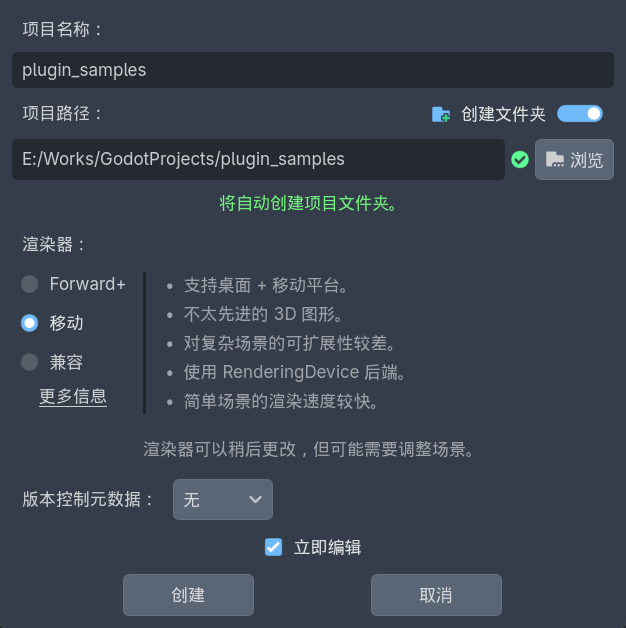

# 制作插件


## 新建项目




## 新建插件

接下来，在当前项目中，我们遵循 Godot 官方标准 创建插件。步骤如下：

+ 创建 `res://addons/<your_plugin_name>` 目录，这是存放插件的标准路径，不可随意更改
+ 创建 `res://addons/<your_plugin_name>/plugin.cfg` 配置文件，这是插件的配置信息
+ 创建 `res://addons/<your_plugin_name>/main.gd` 脚本文件，这是插件功能的入口文件
+ 添加 `res://addons/<your_plugin_name>/logo.svg` 插件图标

::: code-group
```ini [plugin.cfg]
[plugin]

name="Hello"                 # 插件的名称，命名规则："My First Plugin"
description="这是插件的描述"   # 插件的描述
author="乌合之众"             # 作者
version="1.0.0"              # 插件的版本
script="main.gd"            # 插件的脚本入口
```

```GDScript [main.gd]
# 允许编辑器阶段加载脚本（而不仅仅是游戏运行阶段）
@tool

# 自定义的编辑器插件都必须继承 EditorPlugin
extends EditorPlugin

# 只在用户手动点击“启用”按钮时调用一次，适合做一次性设置。
func _enable_plugin() -> void:
	# Add autoloads here.
	pass


func _disable_plugin() -> void:
	# Remove autoloads here.
	pass

# 每次插件被加载进编辑器（包括重启编辑器、切换项目、重新启用）都会调用，适合做“运行时初始化”；
# 确保所有编辑器相关 API 都在 _enter_tree() 之后调用，否则可能因上下文未就绪而报错。
func _enter_tree() -> void:
	add_custom_type("MyButton2", "Button", preload("nodes/my_button2.gd"), preload("Rec-Button.svg"))


func _exit_tree() -> void:
	remove_custom_type("MyButton2")

```
:::

::: tip 关于命名规则
插件名称是 `Hello`，这是在 Godot 资源商店里面显示的名称；插件目录的名称是 `hello`，遵循 snake_case 格式。
:::


### 编写插件的具体功能

我们开始制作插件的具体功能。当用户安装了这款插件，就可以使用我们为他提供的`特殊按钮`；

这个按钮的功能和普通的按钮没什么太大区别，唯一的区别就是点击按钮的时候，会在控制台输出一行日志 `“Hello World!”`。

虽然这个插件没什么实际作用，但是它能很好的让你了解插件是如何运作的。

::: code-group
```GDScript [hello_button.gd]
# 继承自 Godot 官方的按钮
extends Button

func _on_clicked() -> void:
	print("Hello World!")

func _enter_tree() -> void:
    # 连接信号：触发按钮点击事件时，调用 _on_clicked 事件处理函数
	self.pressed.connect(_on_clicked)
```
:::


